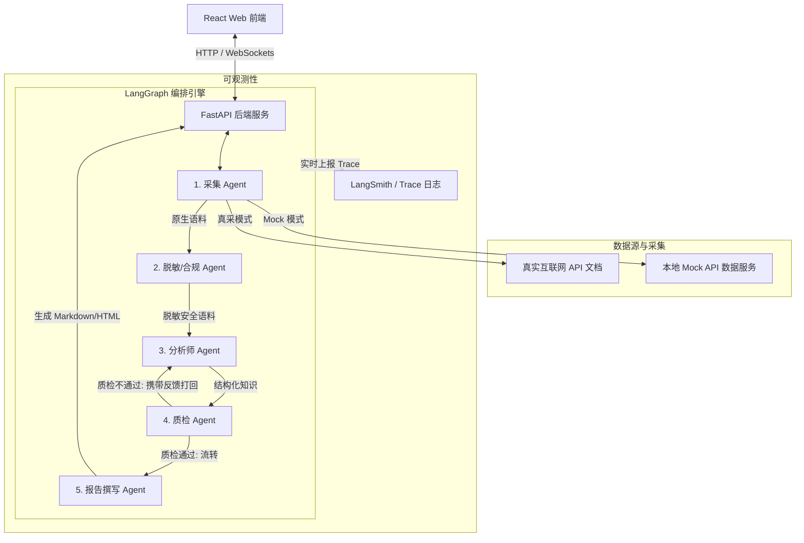

# 系统设计说明书 (Design): 大语言模型 API 竞品分析系统

根据需求澄清结果，本项目使用 **LangGraph** 进行多 Agent 编排，支持 **FastAPI 后端 + React 前端**，并通过 **Docker Compose** 实现本地一键容器化部署。

---

## 1. 架构选型与系统拓扑 (Architecture Overview)

系统采用前后端分离架构加 Mock 数据服务，支持“真采模式”与“Mock 模式”双模运行：



---

## 2. 多 Agent 角色划分与职责 (Agent Roles)

1.  **采集 Agent (Collector Agent)**：
    *   *职责*：根据监测名单（如 OpenAI, 豆包），并发对目标 API 价格页面、限流策略页面进行网页内容抓取。
    *   *真采模式*：使用 HTTP 客户端拉取或通过 Tavily/Reader 抓取。
    *   *Mock 模式*：从内置的本地静态 HTML/JSON 文件中读取预设数据。
2.  **脱敏/合规 Agent (Sanitizer Agent)**：
    *   *职责*：保证数据合规与隐私。使用预设正则及 LLM 双重过滤敏感信息，清除可能露出的个人敏感信息（如包含手机号的日志、包含个人 Key 的代码段等）。
3.  **分析师 Agent (Analyzer Agent)**：
    *   *职责*：从安全的原始语料中，抽取竞品的核心指标，将其整理为标准的 JSON 格式，严格符合定义的强 Schema 规范。
4.  **质检 Agent (QC Agent)**：
    *   *职责*：强行拦截并实施质量门禁。负责 Schema 字段合规性校验及信息可信度评估。如果发现必填数据缺失（如“缺少 Completion Token 单价”）或信息无法溯源，直接通过条件路由打回分析师 Agent，附加修正建议。
5.  **报告撰写 Agent (Writer Agent)**：
    *   *职责*：接收质检通过的结构化数据，渲染产出最终的高质量竞品对比分析报告，包含丰富的数据图表，并在每一项结论上提供信息溯源引用。

---

## 3. 强知识 Schema 定义 (Knowledge Schema)

为保证 Agent 抽取的数据结构一致性，定义以下竞品知识 Schema（JSON）：

```json
{
  "$schema": "http://json-schema.org/draft-07/schema#",
  "title": "LLM_API_Competitor_Intelligence",
  "type": "object",
  "required": ["competitor_name", "model_family", "pricing", "rate_limits", "features", "last_updated"],
  "properties": {
    "competitor_name": { "type": "string", "description": "竞品服务商名称，如 OpenAI, Doubao" },
    "model_family": { "type": "string", "description": "代表性模型系列名称，如 GPT-4o, Doubao-pro" },
    "pricing": {
      "type": "object",
      "required": ["prompt_price_per_million", "completion_price_per_million", "currency"],
      "properties": {
        "prompt_price_per_million": { "type": "number", "description": "每百万 Prompt Token 单价" },
        "completion_price_per_million": { "type": "number", "description": "每百万 Completion Token 单价" },
        "currency": { "type": "string", "enum": ["USD", "CNY"], "description": "计价货币" }
      }
    },
    "rate_limits": {
      "type": "object",
      "required": ["rpm", "tpm"],
      "properties": {
        "rpm": { "type": "integer", "description": "每分钟最大请求数 (Requests Per Minute)" },
        "tpm": { "type": "integer", "description": "每分钟最大 Token 数 (Tokens Per Minute)" }
      }
    },
    "features": {
      "type": "object",
      "required": ["context_window", "function_calling", "vision_support"],
      "properties": {
        "context_window": { "type": "integer", "description": "支持的最大上下文长度 (Token 数)" },
        "function_calling": { "type": "boolean", "description": "是否支持函数调用" },
        "vision_support": { "type": "boolean", "description": "是否支持视觉/多模态输入" }
      }
    },
    "last_updated": { "type": "string", "format": "date-time", "description": "竞品信息提取的时间戳" }
  }
}
```

---

## 4. 可观测性与信息溯源方案 (Observability & Traceability)

### 4.1 LangSmith / Custom Trace 记录
*   系统使用 LangGraph 的生态体系，原生将每一次 Agent 的激活、消息流转、决定路线直接流式推送到 **LangSmith** 平台（若配有凭证）。
*   在未配置 LangSmith 凭证时，系统后端会自动在本地的 `logs/agent_trace.jsonl` 中保存每一次状态转换（State Transition），在前端提供一个**“DAG 轨迹可视化面板”**，用户可以清晰看到各 Agent 的交互及质检打回痕迹。

### 4.2 信息源溯源 Trace (Source Attribution)
*   **分析师 Agent** 在抽取 JSON 时，每一个属性（如 `prompt_price_per_million`）必须在额外的 `metadata.sources` 中记录其对应源语料的上下文文本切片和提取的网页链接 URL。
*   **质检 Agent** 会严格对照源文本，核实提取的数值是否一致，以此抑制大模型幻觉。
*   **报告撰写 Agent** 会将这些溯源信息以超链接/引用的形式渲染在报告中。前端展示报告时，鼠标悬停至相应数值上即可弹窗展示“源文本 Trace”，提供权威、可信的分析报告。

---

## 5. Docker 容器化部署设计 (Docker Compose Deployment)

系统采用 Docker-compose 联合编排，分为三个服务节点，实现一键部署：

1.  **backend**：基于 Python FastAPI 镜像。运行多 Agent 编排引擎，暴露 API 端口（如 `8000`）。
2.  **frontend**：基于 Node.js 镜像，构建 React + Vite 应用，运行在 Nginx 容器上，暴露端口（如 `3000`）。
3.  **mock-server**：简单的 Python Mock HTTP 服务。在“Mock 模式”下，负责返回模拟的、含有干扰敏感隐私信息的各 LLM 服务商原始网页文本，暴露端口（如 `8080`）。

### `docker-compose.yml` 蓝图概要：
```yaml
version: '3.8'

services:
  backend:
    build: ./backend
    ports:
      - "8000:8000"
    environment:
      - DOUBAO_API_KEY=${DOUBAO_API_KEY}
      - DOUBAO_ENDPOINT=${DOUBAO_ENDPOINT}
      - DOUBAO_MODEL=${DOUBAO_MODEL}
      - ENVIRONMENT=production
    depends_on:
      - mock-server

  frontend:
    build: ./frontend
    ports:
      - "3000:3000"
    depends_on:
      - backend

  mock-server:
    build: ./mock_server
    ports:
      - "8080:8080"
```
